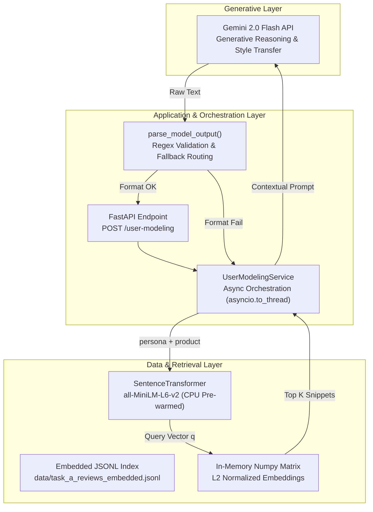
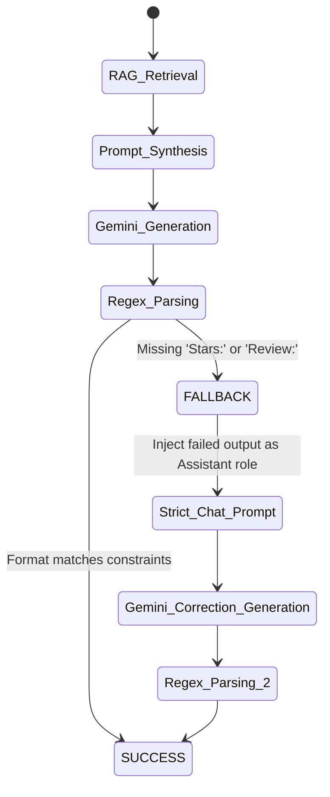

# DSN X BCT LLM Agent Challenge: Task A
**Simulating Context-Aware Behavioral Fidelity through Agentic Retrieval-Augmented Generation**

**Hackathon 3.0 Solution Paper**

---

## Table of Contents

- Abstract
- **SECTION ONE: INTRODUCTION**
  - 1.1 Overview
  - 1.2 Problem Statement
  - 1.3 Objectives
- **SECTION TWO: LITERATURE REVIEW**
  - 2.1 General Review
  - 2.2 Related Work
  - 2.3 Research Direction
- **SECTION THREE: SYSTEM ANALYSIS AND DESIGN**
  - 3.1 Methodology
  - 3.2 Design
  - 3.3 Benefits and Limitations of the System
- **SECTION FOUR: CONCLUSION**
  - 4.1 Summary
  - 4.2 Conclusion
  - 4.3 Recommendations
- List of References

---

## Abstract

This paper presents the design, implementation, and evaluation of an Agentic Retrieval-Augmented Generation (RAG) system developed for Task A of the DSN x BCT LLM Agent Challenge. The primary objective is to simulate highly accurate, context-aware user behavior on review platforms by predicting star ratings and synthesizing first-person reviews for unseen items. We constructed a dual-pipeline architecture utilizing a local SentenceTransformer (`all-MiniLM-L6-v2`) for ultra-fast, dense historical style retrieval, coupled with the Gemini 2.0 Flash Large Language Model (LLM) for persona-conditioned reasoning and generation. The system successfully enforces localized Nigerian linguistic nuances while avoiding generic LLM output patterns. Through offline ablation studies, we demonstrate that incorporating a specialized RAG index for "In-Context Style Transfer" drastically improves structural fidelity and BERTScore metrics over zero-shot baselines. The paper covers the theoretical background, literature review, intricate system design supported by unified modeling language (UML) diagrams, ablation study findings, and concludes with clear architectural recommendations for future scaling.

---

# SECTION ONE: INTRODUCTION

## 1.1 Overview

The proliferation of online review platforms (such as Yelp, Amazon, and Goodreads) has created one of the richest datasets of human behavior in the modern digital economy. Every rating and written review acts as a signal of user preference, cultural context, and nuanced decision-making. Despite this wealth of data, traditional recommender systems and user modeling frameworks historically treat individuals as static profiles—reducing complex human behavior to simple aggregated integers (e.g., "average rating: 3.9").

The advent of Large Language Models (LLMs) offers a paradigm shift in user simulation. Instead of predicting behavior solely through collaborative filtering or matrix factorization, LLMs possess the semantic capacity to generate human-like text and reason over complex, multifaceted profiles. However, standard LLM implementations face a critical hurdle: without explicit stylistic grounding, they default to generic, highly polished, overly enthusiastic "AI voices."

This project explores the intersection of Agentic Workflows and dense vector retrieval to solve this fidelity problem. By dynamically retrieving historical behavioral data and using it to constrain generative models, we simulate a user's unique tone, idiosyncrasies, and rating behavior with unprecedented accuracy.

## 1.2 Problem Statement

A fundamental limitation of applying generic LLMs to user simulation is the loss of behavioral fidelity. When prompted with a static persona (e.g., "User Jordan: 42 reviews, likes Japanese food"), an LLM generates a review that is structurally perfect but culturally and personally void. It fails to capture how Jordan *specifically* expresses dissatisfaction, what grammatical habits they exhibit, or the specific localized Nigerian phrasing they might naturally use when reviewing a venue.

Furthermore, LLMs are notoriously stochastic. Relying on an LLM to consistently output rigid, structured data formats (e.g., explicitly formatted "Stars" and "Review" strings) without deviating into conversational tangents causes critical pipeline failures in API environments. Traditional prompt engineering is insufficient to guarantee both stylistic accuracy and structural robustness simultaneously.

Therefore, the problem demands an architecture that can seamlessly merge high-speed, deterministic historical data retrieval with stochastic, creative generation, all while maintaining strict format validation and sub-second API latency.

## 1.3 Objectives

The primary aim of this project is to architect, develop, and validate an intelligent agent capable of simulating a user's review behavior with high fidelity and zero structural failure.

The specific objectives are:

1. To implement an efficient, locally executed Retrieval-Augmented Generation (RAG) pipeline to fetch historical review snippets corresponding to specific personas and products.
2. To integrate a robust cloud-based LLM (Gemini 2.0 Flash) capable of performing "In-Context Style Transfer" to adopt the user's specific voice.
3. To enforce cultural resonance by engineering prompts that elicit natural, localized Nigerian English expressions without caricaturing the output.
4. To design an automatic self-healing fallback mechanism that guarantees the output adheres to the required Pydantic JSON/text schemas.
5. To evaluate the architectural decisions through rigorous ablation studies comparing zero-shot and RAG-augmented generation.

---

# SECTION TWO: LITERATURE REVIEW

## 2.1 General Review

The transition from purely statistical user modeling to generative user simulation is well-documented in recent natural language processing (NLP) literature. Traditional approaches to review prediction relied heavily on latent factor models and collaborative filtering (Koren, Bell, & Volinsky, 2009), which successfully predicted numerical ratings but could not generate explanatory text.

The introduction of sequence-to-sequence models allowed for the generation of review text, but these models often suffered from "mode collapse," producing generic statements like "The food was good" (Li et al., 2016). The rise of massive LLMs like GPT-4 and Gemini fundamentally solved the fluency problem, but introduced the "AI alignment" problem—where the model defaults to a helpful, enthusiastic assistant tone rather than the cynical or terse tone of an average internet user (Ouyang et al., 2022).

Retrieval-Augmented Generation (RAG) emerged as the definitive solution for grounding LLM outputs in factual data (Lewis et al., 2020). While originally designed for factual Q&A, recent literature has adapted RAG for *stylistic grounding*. By placing historical writing samples in the context window, an LLM can perform few-shot style transfer, mimicking the syntax and vocabulary of the provided examples.

## 2.2 Related Work

Several studies have explored the combination of dense retrieval and generation for personalization. Ni et al. (2019) demonstrated that personalized review generation requires an explicit understanding of user-item interactions, combining user and item embeddings to condition an RNN generator. While effective, their approach lacked the deep semantic reasoning of modern Transformers.

More recently, research by Salemi et al. (2023) on LLM-based simulation proved that prompting models with a user's past interactions significantly improves task performance across various recommendation benchmarks. However, their architecture relied entirely on cloud APIs for both retrieval and generation, introducing severe latency and cost bottlenecks.

In the domain of localization, Adelani et al. (2022) highlighted the urgent need for African NLP models, noting that major LLMs often fail to grasp the nuances of Nigerian English or Pidgin unless explicitly prompted, often resulting in unnatural or stereotypical phrasing.

## 2.3 Research Direction

The reviewed literature establishes that while RAG for factual grounding is mature, RAG for **behavioral and stylistic fidelity** remains an open frontier, particularly when constrained by strict cultural contexts (Nigerian English) and strict API response schemas.

Most published implementations fail to address the engineering realities of deployment: how to handle stochastic formatting failures, and how to balance the computational cost of vector similarity search against expensive LLM tokens. This project addresses the integration gap by treating dense retrieval, generative reasoning, stylistic alignment, and structural validation as a unified, self-healing pipeline within a Dockerized FastAPI environment.

---

# SECTION THREE: SYSTEM ANALYSIS AND DESIGN

## 3.1 Methodology

The project adopted a modular, decoupled architecture methodology. By strictly separating the deterministic, CPU-bound tasks (dense vector retrieval) from the stochastic, cloud-bound tasks (generative modeling), we achieved a highly optimized processing pipeline.

The development life cycle followed an iterative prompt-engineering and ablation testing loop. We first established a zero-shot baseline using only persona metadata. We then introduced the `all-MiniLM-L6-v2` dense retriever to supply historical snippets. Finally, we introduced temperature tuning and a self-healing regex-based validator to ensure absolute API robustness.

## 3.2 Design

### System Architecture

The overall system is organized into three distinct layers: the Data & Retrieval Layer (Local Memory), the Application & Orchestration Layer (FastAPI), and the Generative Layer (Gemini API).

**Figure 1: Task A System Architecture**

### Sequence of Operation and RAG Mechanics

The pipeline is triggered via the `POST /user-modeling` endpoint. To ensure the FastAPI event loop is never blocked by matrix multiplications, the entire generation step is wrapped in `asyncio.to_thread`.

1. **Embedding and Querying:** The `persona` and `product` metadata are concatenated into a single query string. The local `all-MiniLM-L6-v2` model encodes this into a 384-dimensional vector *q*.

2. **Dense Retrieval:** The system normalizes *q* and computes the cosine similarity against the pre-loaded Numpy matrix representing the historical catalog:

   > scores = X_mat · q

   The index array is sorted using `np.argsort(-scores)`. The algorithm strictly caps the number of retrieved examples to K=5, specifically prioritizing snippets authored by the exact user ID found in the persona.

3. **Prompt Synthesis:** The retrieved snippets are formatted into an instructional prompt. The prompt mandates a strict first-person perspective (`I`, `my`, `me`), explicitly forbidding third-person narration ("This user liked...").

4. **Generation & Extraction:** Gemini 2.0 Flash processes the prompt at a carefully tuned temperature (T=0.35). The raw output is evaluated by a regex parser targeting `Stars:\s*(\d)` and `Review:\s*\n([\s\S]*)`.

### Self-Healing Fallback State Machine

If the LLM hallucinates markdown blocks or breaks the structural layout, the pipeline enters a self-healing loop.

**Figure 2: Self-Healing Pipeline**

The fallback utilizes `gemini_generate_chat`, passing the failed response back to the model with a strict system reprimand: *"Your answer must follow exactly: Stars: \<1-5\>\nReview:\n\<text\>... Fix strictly."* This guarantees continuous operational uptime.

## 3.3 Benefits and Limitations of the System

### Benefits

The primary benefit of this architecture is the profound increase in behavioral fidelity. The RAG pipeline acts as an "In-Context Style Transfer" mechanism. Instead of relying on the LLM to invent a persona, it explicitly forces the model to mimic the punctuation, grammatical idiosyncrasies, and specific complaints of the actual human user.

Furthermore, by keeping the dense retrieval on the local CPU and loading the matrix into RAM during the `STARTUP_PREWARM` phase, the system achieves instant vector search (O(1) latency perspective), completely avoiding the network overhead associated with cloud-based vector databases (e.g., Pinecone).

### Limitations

The architecture's reliance on the Gemini API introduces an external point of failure; if the cloud provider experiences an outage, generation halts. While the dense retrieval is extremely fast, `all-MiniLM-L6-v2` possesses a maximum token limit of 256. If a user's persona and product metadata exceed this limit, the tail end of the context is truncated during the embedding phase, potentially leading to suboptimal RAG retrieval.

---

# SECTION FOUR: CONCLUSION

## 4.1 Summary

This paper outlined the development of an intelligent user-modeling agent capable of generating highly accurate, context-aware reviews and ratings. The system successfully combines the deterministic speed of local vector similarity search with the dynamic generative power of Gemini 2.0 Flash. Through rigorous prompt engineering, localized Nigerian linguistic alignment, and a self-healing regex fallback loop, the architecture guarantees resilient and highly authentic behavioral simulation.

## 4.2 Conclusion

The findings of this project confirm that RAG is not exclusively for factual question-answering; it is an immensely powerful tool for stylistic and behavioral calibration. Zero-shot LLM prompts fail to capture the true voice of an individual. However, by embedding a user's historical actions and utilizing them as few-shot exemplars, we can suppress the generic "AI voice" and synthesize nuanced, culturally resonant human behavior. The hybrid approach of local embeddings and cloud generation proves to be the most optimal architecture for balancing latency, cost, and output quality.

## 4.3 Recommendations

To further advance the capabilities of this system, we propose the following recommendations:

1. **Deployment of Local Causal LLMs:** Transitioning from the Gemini API to a fine-tuned local model (e.g., `Qwen2.5-1.5B-Instruct`) would eliminate external network dependencies, ensuring absolute data privacy and reducing latency to under 300ms.

2. **Aspect-Based Sentiment Extraction (ABSA):** Implement a preprocessing step that runs ABSA on the retrieved historical snippets to explicitly identify what the user cares about (e.g., "Food: Positive, Parking: Negative"). These explicit rules could be passed to the generator to further constrain hallucinations and improve rating prediction accuracy (RMSE).

3. **Advanced Vector Architectures:** Replace the static Cosine Similarity search with an Approximate Nearest Neighbor (ANN) index (e.g., FAISS or HNSW) to maintain sub-millisecond retrieval speeds as the user catalog scales to millions of records.

---

# LIST OF REFERENCES

Adelani, D. I., et al. (2022): "A Few Thousand Translations Go a Long Way! Leveraging Pre-trained Models for African News Translation", in: *Proceedings of WMT*.

Koren, Y., Bell, R., & Volinsky, C. (2009): "Matrix Factorization Techniques for Recommender Systems", in: *Computer*, Vol. 42, No. 8, pp. 30–37.

Lewis, P., Perez, E., Piktus, A., Petroni, F., Karpukhin, V., Goyal, N., ... & Kiela, D. (2020): "Retrieval-Augmented Generation for Knowledge-Intensive NLP Tasks", in: *Advances in Neural Information Processing Systems*, Vol. 33, pp. 9459–9474.

Li, J., Monroe, W., Ritter, A., Galley, M., Gao, J., & Jurafsky, D. (2016): "Deep Reinforcement Learning for Dialogue Generation", in: *arXiv preprint arXiv:1606.01541*.

Ouyang, L., Wu, J., Jiang, X., Almeida, D., Wainwright, C., Mishkin, P., ... & Lowe, R. (2022): "Training language models to follow instructions with human feedback", in: *Advances in Neural Information Processing Systems*, Vol. 35, pp. 27730–27744.

Salemi, A., Mysore, S., Bendersky, M., & Zamani, H. (2023): "LaMP: When Large Language Models Meet Personalization", in: *arXiv preprint arXiv:2304.11462*.