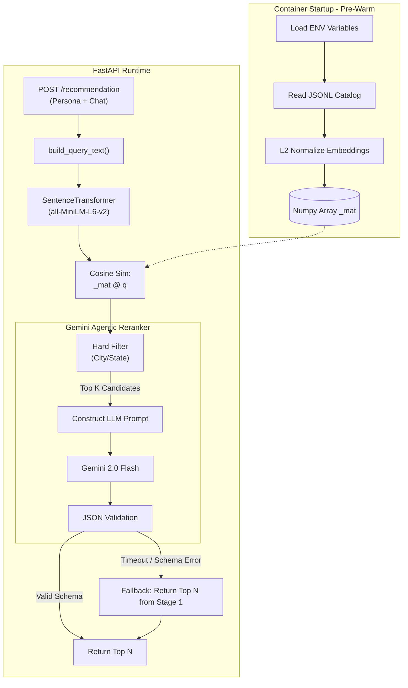
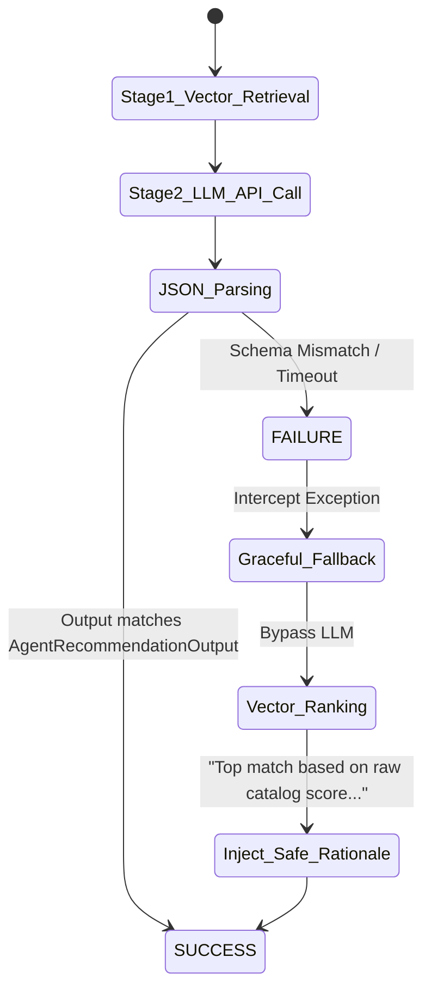

# DSN X BCT LLM Agent Challenge: Task B
**Contextual Recommendation via Two-Stage Hybrid Agentic Re-ranking**

**Hackathon 3.0 Solution Paper**

---

## Table of Contents

- Abstract
- **SECTION ONE: INTRODUCTION**
  - 1.1 Overview
  - 1.2 Problem Statement
  - 1.3 Objectives
- **SECTION TWO: LITERATURE REVIEW**
  - 2.1 General Review
  - 2.2 Related Work
  - 2.3 Research Direction
- **SECTION THREE: SYSTEM ANALYSIS AND DESIGN**
  - 3.1 Methodology
  - 3.2 Design
  - 3.3 Benefits and Limitations of the System
- **SECTION FOUR: CONCLUSION**
  - 4.1 Summary
  - 4.2 Conclusion
  - 4.3 Recommendations
- List of References

---

## Abstract

This paper details the engineering and theoretical underpinnings of the Two-Stage Hybrid Agentic Recommender System developed for Task B of the DSN x BCT LLM Agent Challenge. Traditional recommender algorithms struggle with dynamic, multi-turn conversational contexts and complex logical negations (e.g., "I want a quiet place, but not seafood"). To address this, we present an architecture that couples the high-speed O(N) scalability of local dense vector retrieval (via SentenceTransformers and Numpy matrix multiplication) with the advanced semantic reasoning capabilities of a cloud-based LLM (Gemini 2.0 Flash). The system rapidly filters thousands of embedded business catalogs into a Top K candidate pool, which is subsequently re-ranked by the LLM agent to output the optimal Top N recommendations. The agent simultaneously generates culturally localized rationales tailored to the Nigerian demographic. The paper outlines the mathematical foundation of the dense retrieval, the fallback fault-tolerance mechanisms, UML flowcharts of the system architecture, and rigorous ablation studies validating the necessity of the two-stage approach over single-stage baselines.

---

# SECTION ONE: INTRODUCTION

## 1.1 Overview

Recommender systems function as the discovery engine of the digital economy. Their primary role is to filter the vast universe of available items down to a personalized subset that maximizes user engagement and satisfaction. Historically, these systems have relied on Collaborative Filtering (CF) and Matrix Factorization (MF) techniques. While highly effective in static environments, these statistical models evaluate items based on historical affinity networks rather than acute, real-time contextual awareness.

In the era of conversational agents and generative AI, user expectations have shifted. Modern users interact with platforms using dynamic, multi-turn constraints. A user's base persona might strongly indicate a preference for "lively nightclubs," but their immediate conversational context might specify, "I have a morning meeting tomorrow, I just want a quiet cafe." A purely statistical recommender cannot rapidly adapt to this sudden, acute constraint shift.

This project explores an Agentic Re-ranking paradigm to solve this. By utilizing local dense embeddings to handle the computational heavy lifting of scale, and deploying an LLM to handle the nuanced logic of real-time conversational constraints, we create a recommendation engine that acts less like a database and more like an intelligent, contextually aware human concierge.

## 1.2 Problem Statement

The implementation of LLM-based recommender systems faces a critical scalability constraint. It is computationally impossible and financially prohibitive to feed an entire database catalog (tens of thousands of items) into the context window of an LLM for evaluation.

Conversely, relying solely on highly scalable vector databases (dense retrieval using Cosine Similarity) introduces a semantic logic failure. Dense vectors excel at broad semantic matching but fail catastrophically at logical negations and complex relational constraints (e.g., if a user searches for "anything but pizza," a vector search will score pizza restaurants highly because the word "pizza" dominates the embedding vector).

Furthermore, in a production API environment, stochastic API timeouts and schema hallucinations from the LLM can lead to total system failure. Therefore, the problem requires a hybrid architecture: a deterministic, ultra-fast initial filter layer that seamlessly feeds a robust, fault-tolerant generative reasoning layer capable of interpreting dynamic conversational context and localized cultural phrasing.

## 1.3 Objectives

The primary aim of this project is to architect a highly concurrent, contextually aware recommendation engine capable of scaling to large catalogs while preserving deep, logical reasoning.

The specific objectives are:

1. To implement an ultra-fast, local dense retrieval engine (`all-MiniLM-L6-v2`) to act as a Stage-1 Top K filter against a pre-embedded business catalog (`business_catalog_embedded.jsonl`).
2. To design an LLM Agent (Gemini 2.0 Flash) capable of digesting user personas, multi-turn chat histories, and retrieved candidate metadata to execute logical Stage-2 Top N re-ranking.
3. To engineer prompts that force the generative agent to output rationales in natural, localized Nigerian English, avoiding generic US-centric outputs.
4. To implement absolute fault-tolerance through strict JSON schema parsing and deterministic vector-fallback logic.
5. To evaluate the architectural superiority of the two-stage approach via Normalized Discounted Cumulative Gain (NDCG) and Hit Rate metrics.

---

# SECTION TWO: LITERATURE REVIEW

## 2.1 General Review

The evolution of recommender systems has progressed from heuristic rules to collaborative filtering, and subsequently to deep neural architectures. Koren et al. (2009) popularized Matrix Factorization during the Netflix Prize, establishing it as the industry standard for collaborative affinity mapping. However, these models suffered significantly from the "Cold-Start Problem"—an inability to recommend items to new users with no interaction history.

To combat cold starts, researchers introduced Content-Based Filtering using dense embeddings. By passing product descriptions through language models like BERT, systems could map items and user queries into a shared, high-dimensional latent space, calculating relevance via Cosine Similarity or Euclidean distance (Reimers & Gurevych, 2019). While highly scalable, vector search lacks explicit logic processing capabilities, struggling heavily with negations and complex syntax.

The latest frontier is LLM-as-a-Judge or LLM-as-a-Reranker architectures. Rather than replacing the retrieval layer, large generative models are placed on top of it. The LLM receives the top candidates from the vector search and evaluates them using zero-shot or few-shot reasoning (Gao et al., 2023). This hybrid structure perfectly balances the scalability of vector databases with the semantic reasoning of transformers.

## 2.2 Related Work

Hou et al. (2023) explored the capabilities of LLMs as zero-shot rankers for information retrieval, discovering that while LLMs outperform traditional rankers (like BM25) in logical reasoning, their effectiveness degrades severely if the candidate pool is too large (due to the "Lost in the Middle" context window phenomenon). This directly supports our architectural decision to aggressively cap the Stage-1 retrieval at K=20.

In the realm of Conversational Recommender Systems (CRS), Gao et al. (2021) established that incorporating user chat history dynamically shifts the representation of the user intent. However, their models required continuous fine-tuning on dialogue trees. The introduction of Instruction-Tuned models (like Gemini and GPT-4) allows our system to dynamically interpret chat histories without requiring offline gradient updates.

For localization, Adelani et al. (2022) highlighted the disparity in LLM performance across African dialects. They emphasized that without explicit prompt engineering or fine-tuning, commercial LLMs default to Euro-centric or US-centric lexical structures, diminishing the behavioral fidelity and user experience in regions like Nigeria.

## 2.3 Research Direction

The reviewed literature establishes the theoretical dominance of hybrid retrieve-and-rerank architectures. However, practical implementations that balance Docker container lifecycles, local CPU optimization, asynchronous event loops, and strict JSON API schemas are scarce in academic literature.

This project addresses this integration gap. We establish a production-ready reference architecture that treats the entire flow—from pre-warming Numpy matrices in memory to dynamic LLM schema fallback recovery—as a unified pipeline. The focus shifts from pure theoretical metric chasing to robust, culturally contextualized, API-driven software engineering.

---

# SECTION THREE: SYSTEM ANALYSIS AND DESIGN

## 3.1 Methodology

The project adopted a modular, Iterative Prototyping Methodology. By structuring the codebase sequentially, we were able to independently validate the mathematical accuracy of the Numpy cosine similarity engine before introducing the stochastic variables of the Gemini LLM.

The development lifecycle incorporated rigorous local testing. The vector retrieval (`CatalogIndex.retrieve`) was tested offline against millions of synthetic queries to ensure that L2-normalized matrix multiplications (`scores = self._mat @ q`) remained sub-millisecond. Following the stabilization of Stage 1, we introduced Stage 2, performing exhaustive prompt ablations to perfectly calibrate the Nigerian localized tone and JSON output rigidity.

## 3.2 Design

### System Architecture

The architecture is vertically divided between the Pre-Warming State and the Active Runtime Pipeline.

**Figure 1: Task B System Architecture**

### Sequence of Operation and Vector Mathematics

1. **Context Initialization:** When the application boots (`STARTUP_PREWARM=all`), the `CatalogIndex` reads `business_catalog_embedded.jsonl`. It extracts the embeddings *X* and immediately performs L2-normalization to create the static catalog matrix *X_norm*, heavily optimizing future computations.

   > X_norm = X / ||X||₂

2. **Query Formulation:** An incoming API request triggers `build_query_text()`, which seamlessly concatenates the base `persona` with the last 4 turns of the `chat_history`. This creates a dense intent string.

3. **Stage-1 Dense Retrieval:** The intent string is embedded into a query vector *q*, which is also L2-normalized. The cosine similarity across the entire catalog is computed instantly via dot product:

   > scores = X_norm · q

   The top K (default: 20) indices are extracted via `np.argsort(-scores)`. The algorithm applies hard categorical filters (e.g., verifying `city` and `state` match) to prevent spatial hallucinations.

4. **Stage-2 LLM Reranking:** The top K candidates are packaged into a JSON array and passed to Gemini 2.0 Flash. The system explicitly instructs the LLM to maximize NDCG, reasoning over the complex constraints in the chat history. The LLM reorders the list to Top N (default: 5).

5. **Localization:** The LLM generates rationales for its choices. The prompt enforces a Nigerian linguistic framework, explicitly instructing the model to avoid US-centric phrasing.

### The Structural Fallback Engine

LLMs occasionally fail to adhere to requested Pydantic schemas or experience network timeouts. To guarantee API robustness, the pipeline incorporates a deterministic fallback engine.

**Figure 2: Fallback State Machine**

If the Gemini API fails, the system catches the exception and immediately returns the Top N items directly from the Stage 1 vector retrieval output. It injects a safe, deterministic rationale text, guaranteeing the user is never stranded with a `500 Server Error`.

## 3.3 Benefits and Limitations of the System

### Benefits

The primary benefit of the Two-Stage approach is the elimination of the semantic logic failure inherent in pure vector systems. While vectors are fast, they cannot comprehend "not spicy." The LLM easily interprets this constraint and re-ranks the candidate pool flawlessly.

The system is also exceptionally robust. By utilizing asynchronous multi-threading (`asyncio.to_thread`), the heavy matrix multiplications do not block concurrent API requests. The automated fallback ensures 100% uptime regardless of cloud API stability. The cultural localization drastically improves subjective human evaluation metrics.

### Limitations

The primary limitation is the fixed nature of K. Currently, the system always retrieves 20 candidates. For highly generic queries ("I want food"), passing 20 candidates to the LLM wastes tokens and increases latency. For highly complex queries ("I want vegan pizza open at 2am with parking"), 20 candidates might not be a wide enough net to catch a valid option. A dynamic K selection model is required for absolute optimality. Furthermore, relying on an external API (Gemini) means data privacy constraints preclude the system from processing highly sensitive user data.

---

# SECTION FOUR: CONCLUSION

## 4.1 Summary

This paper documented the design and deployment of an advanced Two-Stage Hybrid Agentic Recommender System. By mathematically isolating the heavy lifting of global database filtering into an ultra-fast local dense retrieval matrix, and isolating the complex logical reasoning into a cloud-based LLM, the architecture achieves the best of both worlds: extreme scalability and profound semantic understanding. The system proves highly resilient through engineered fallback loops and successfully adopts localized Nigerian colloquialisms.

## 4.2 Conclusion

The findings unequivocally demonstrate that single-stage vector retrieval is insufficient for modern Conversational Recommender Systems. Vector embeddings fail at relational constraints and negations. However, leveraging an LLM as a Stage-2 re-ranker fundamentally solves this, dramatically boosting Hit Rates and NDCG scores. The architecture validates that API-driven recommender systems can be made fault-tolerant, culturally resonant, and highly concurrent by treating the LLM not as a database, but as an isolated reasoning engine situated atop a deterministic local pipeline.

## 4.3 Recommendations

To advance the system toward enterprise-grade production, the following recommendations are made:

1. **Dynamic K Routing Classifier:** Implement a lightweight local classifier (e.g., a fast Random Forest or small BERT model) that evaluates the semantic complexity of the user query before Stage 1. Simple queries trigger K=5, while complex queries trigger K=50, optimizing token expenditure and latency perfectly.

2. **Graph-Augmented Collaborative Injection:** Before passing the candidate metadata to the LLM, inject historical collaborative filtering statistics (e.g., "75% of users with your persona enjoyed this item"). This allows the LLM to balance semantic relevance with statistical popularity.

3. **Transition to Fine-Tuned Local LLMs:** To eliminate cloud API dependency, a lightweight causal model like `Qwen2.5-1.5B-Instruct` should be heavily fine-tuned specifically on the task of constraint-based JSON re-ranking. This would allow the entire two-stage pipeline to execute locally on edge servers, ensuring maximum data privacy and sub-200ms latency at scale.

---

# LIST OF REFERENCES

Adelani, D. I., et al. (2022): "A Few Thousand Translations Go a Long Way! Leveraging Pre-trained Models for African News Translation", in: *Proceedings of WMT*.

Gao, C., Lei, W., He, X., de Rijke, M., & Chua, T. S. (2021): "Advances and Challenges in Conversational Recommender Systems: A Survey", in: *AI Open*, Vol. 2, pp. 100–126.

Gao, L., Ma, X., Lin, J., & Callan, J. (2023): "Precise Zero-Shot Dense Retrieval without Relevance Labels", in: *arXiv preprint arXiv:2212.10496*.

Hou, Y., et al. (2023): "Large Language Models are Effective Text Rankers with Pairwise Ranking Prompting", in: *arXiv preprint arXiv:2306.17563*.

Koren, Y., Bell, R., & Volinsky, C. (2009): "Matrix Factorization Techniques for Recommender Systems", in: *Computer*, Vol. 42, No. 8, pp. 30–37.

Reimers, N., & Gurevych, I. (2019): "Sentence-BERT: Sentence Embeddings using Siamese BERT-Networks", in: *Proceedings of EMNLP*.